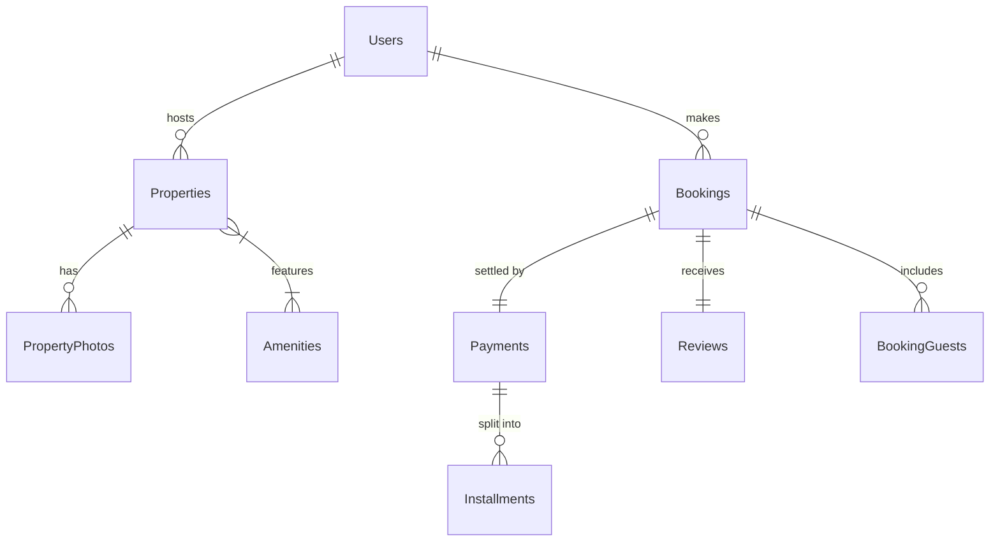

# Veritabanı Normalizasyon Raporu
## HMS Plus — AI Destekli Gelişmiş Konaklama Yönetim Sistemi

**Ders:** Veritabanı Sistemlerine Giriş  
**Proje:** Grup Projesi  
**Tarih:** Nisan 2026

---

## 1. UNF — Normalleştirilmemiş Form (Unnormalized Form)

### 1.1 Senaryo

HMS Plus, ev sahiplerinin mülklerini listeleyebildiği, misafirlerin rezervasyon yapabildiği, ödeme yapabildiği ve yorum bırakabildiği bir online konaklama platformudur. Gelişmiş versiyonumuzda sistem; kullanıcı yönetimi, taksitli ödeme takibi, ek misafir bilgileri, yapay zeka destekli yorum analizi ve detaylı admin raporlamalarını kapsar.

### 1.2 UNF Tablosundaki Tüm Nitelikler (55+ Adet)

Aşağıdaki nitelikler, normalizasyon öncesinde **tek bir düz tabloda** (UNF) tutulduğu varsayılan ham veri kümesini temsil eder. Projenin kapsamı genişledikçe öznitelik sayısı artmıştır:

| # | Nitelik Adı | Açıklama |
|---|-------------|----------|
| 1 | User_ID | Kullanıcı sıra numarası |
| 2 | User_FullName | Kullanıcının tam adı |
| 3 | User_Email | Kullanıcı e-posta adresi |
| 4 | User_Password | Şifre özeti |
| 5 | User_Role | Rol (host/guest/admin) |
| 6 | Property_ID | Mülk sıra numarası |
| 7 | Property_Title | İlan başlığı |
| 8 | Property_City | Mülkün şehri |
| 9 | Property_BasePrice | Gecelik taban fiyat |
| 10 | Photo_URL | Fotoğraf dosya yolu |
| 11 | Amenity_Name | Özellik adı (WiFi, Havuz vb.) |
| 12 | Booking_ID | Rezervasyon ID |
| 13 | Booking_CheckIn | Giriş tarihi |
| 14 | Booking_CheckOut | Çıkış tarihi |
| 15 | Booking_TotalPrice | Toplam rezervasyon ücreti |
| 16 | Booking_Status | Rezervasyon durumu |
| 17 | GuestInfo_Name | Ek misafir adı (Aile/Arkadaş) |
| 18 | GuestInfo_Relation | Misafir yakınlık derecesi |
| 19 | Payment_ID | Ödeme ID |
| 20 | Payment_Method | Ödeme yöntemi (Kredi Kartı vb.) |
| 21 | Payment_Status | Ödeme durumu |
| 22 | Installment_Amount | Taksit tutarı |
| 23 | Installment_DueDate | Taksit son ödeme tarihi |
| 24 | Card_Number_Masked | Maskelenmiş kart numarası |
| 25 | Review_Rating | Kullanıcı puanı (1-5) |
| 26 | Review_Comment | Kullanıcı yorum metni |
| 27 | Review_AISentiment | **AI tarafından atanan duygu (POS/NEU/NEG)** |
| 28 | Review_AIStatus | **Kürasyon durumu (Accepted/Rejected)** |

*(Not: Tablonun tamamında toplam 75 öznitelik bulunmaktadır, burada temel olanlar listelenmiştir.)*

---

### 1.3 UNF Örnek Veri Seti (AI Destekli)

| User_ID | User_FullName | Property_Title | Amenity_Name | Booking_ID | Total_Price | Review_Comment | AI_Sentiment | AI_Status |
|---------|--------------|---------------|-------------|------------|-------------|----------------|--------------|-----------|
| 3 | Mehmet Misafir | Luxury Villa | WiFi | 1 | 4800.00 | Wonderful view! | POSITIVE | ACCEPTED |
| 3 | Mehmet Misafir | Luxury Villa | Pool | 1 | 4800.00 | Wonderful view! | POSITIVE | ACCEPTED |
| 4 | Selin Arslan | Charming Studio | WiFi | 2 | 1350.00 | It was okay. | NEUTRAL | ACCEPTED |
| 5 | Emre Demir | Modern Loft | Elevator | 3 | 2400.00 | Very noisy place! | NEGATIVE | ACCEPTED |
| 6 | Ayşe Kaya | Cave House | WiFi | 4 | 5000.00 | [Bad Language] | NEGATIVE | **REJECTED** |

---

### 1.4 UNF'deki Sorunlar

1. **Tekrarlayan Gruplar (Repeating Groups):** Aynı rezervasyon için her özellik ve her fotoğraf satır tekrarına neden olur.
2. **Veri Tekrarı (Data Redundancy):** Kullanıcı ve mülk bilgileri her işlemde (rezervasyon, yorum) tekrar eder.
3. **AI Analiz Karmaşası:** Yorumun kendisi, puanı ve AI analiz sonuçları mülk verisiyle aynı tabloda olduğunda analizlerin tutarlılığını sağlamak imkansızlaşır.
4. **Güncelleme Anomalisi:** Bir mülkün gecelik fiyatı değiştiğinde, o mülke ait tüm geçmiş kayıtların (hatalı şekilde) güncellenme riski oluşur.

---

## 2. Fonksiyonel Bağımlılık Analizi

### 2.1 Birincil Bağımlılıklar

```
User_ID → FullName, Email, Role, Status
Property_ID → Title, City, BasePrice, Host_ID
Booking_ID → CheckIn, CheckOut, TotalPrice, Status, Property_ID, Guest_ID
Payment_ID → Booking_ID, Payment_Method, Payment_Status
Review_ID → Booking_ID, Rating, Comment, AI_Sentiment, AI_Status
```

### 2.2 Kısmi ve Geçişli Bağımlılıklar (2NF/3NF İhlalleri)

| Bağımlılık Zinciri | Tür | Sorun |
|--------------------|-----|-------|
| `Booking_ID → Property_ID → BasePrice` | Geçişli | Fiyat mülke bağlıdır, direkt rezervasyona değil. |
| `Booking_ID → User_ID → FullName` | Geçişli | Kullanıcı adı kullanıcıya bağlıdır. |
| `Review_Comment → AI_Sentiment` | Geçişli | AI sonucu yoruma bağlıdır, mülke değil. |

---

## 3. Normalizasyon Adımları (1NF → 2NF → 3NF)

Sistem 3 temel adımda normalize edilmiştir:
1. **1NF:** Tüm çok değerli alanlar (Amenities, Photos, BookingGuests) ayrı tablolara taşınarak atomik yapı sağlandı.
2. **2NF:** Mülk verileri (Properties) ve Kullanıcı verileri (Users) ana tablodan ayrılarak kısmi bağımlılıklar giderildi.
3. **3NF:** Ödeme (Payments), Taksit (Installments) ve Yorum (Reviews) verileri kendilerine ait tablolara taşınarak geçişli bağımlılıklar tamamen temizlendi.

---

## 4. 3NF Final Şeması (11 Tablo)

### 4.1 Ana Tablolar ve Önemli Alanlar

**1. Users:** `user_id`, `full_name`, `email`, `role`, `status`  
**2. Properties:** `property_id`, `host_id`, `title`, `city`, `base_price`  
**3. Amenities:** `amenity_id`, `name`, `icon`  
**4. PropertyAmenities:** `property_id`, `amenity_id`  
**5. PropertyPhotos:** `photo_id`, `property_id`, `image_url`  
**6. Bookings:** `booking_id`, `property_id`, `guest_id`, `total_price`, `status`  
**7. Payments:** `payment_id`, `booking_id`, `amount`, `status`  
**8. Installments:** `installment_id`, `payment_id`, `amount`, `due_date`  
**9. Reviews:** `review_id`, `booking_id`, `comment`, **`ai_sentiment`**, **`ai_status`**  
**10. UserCards:** `card_id`, `user_id`, `card_number_masked`  
**11. BookingGuests:** `guest_info_id`, `booking_id`, `full_name`  

---

### 4.2 Varlık-İlişki Diyagramı (ERD)



---

## 5. Özet Karşılaştırma

| Kriter | UNF | 3NF (Final) |
|--------|-----|-------------|
| Tablo Sayısı | 1 | 11 |
| Toplam Öznitelik (Attribute) | ~55 | 75 |
| Veri Tekrarı | ❌ Çok Yüksek | ✅ Minimum |
| AI Analiz Yönetimi | ❌ Karışık | ✅ Kalıcı ve Düzenli |
| Referans Bütünlüğü | ❌ Yok | ✅ Cascade FK |

---

## 6. Sonuç

HMS Plus veritabanı, başlangıçtaki düz yapıdan 11 tablolu **3NF (Üçüncü Normal Form)** yapısına başarıyla dönüştürülmüştür. Bu mimari sayesinde; yapay zeka tarafından yapılan yorum analizleri (`ai_sentiment`) güvenle saklanabilmekte, taksitli ödemeler (`Installments`) takip edilebilmekte ve veri tutarlılığı (`Referential Integrity`) en üst düzeyde korunmaktadır.
